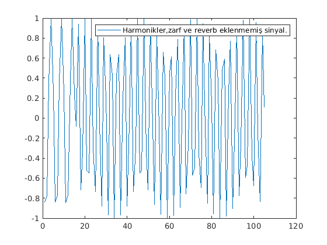
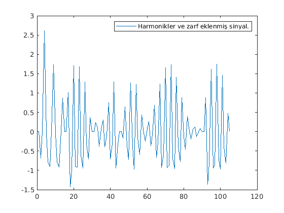
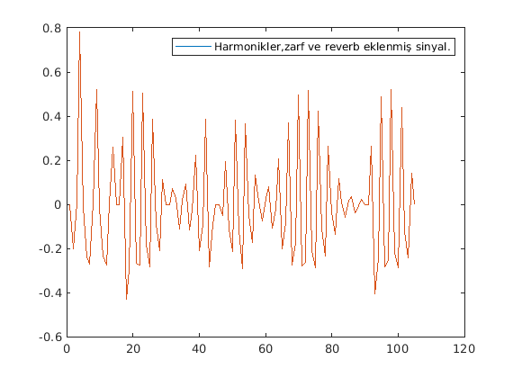

# Sinyal İşleme Projesi

Tuğba FIÇICI

30116005

Sinyal İşleme

Proje: MATLAB ile sentezleme

## Proje Hakkında

Bir program kullanılarak oluşturulmuş müzik notalarının fonksiyon yardımı ile sayısal değerlere döküldükten sonra bu  değerlerin kullanılarak notaların sinyallerinin oluşturulması, harmonik sinyallerinin oluşturulması, iki farklı zarf kullanılması ve sinyallere yankı eklenerek gerçek müziğe yakın bir sinyal çıktısı elde etmektir. Projede MuseScore ve MATLAB kullanılmıştır.

## Parse Edilmiş Veri Hakkında

MuseScore programı kullanılarak oluşturulan notalar (notaların resmi aşağıda verilmiştir.) üç farklı uzantıda kaydediliyor. .musicxml uzantılı dosya, elimizde bulunan "parseMusicXML" fonksiyonu kullanılarak nota bazlı parçalanıyor ve değerleri matris çıktısı olarak alınıyor. Çıktı olarak alınan matriste 19 sütun içinden aşağıda belirtilen sütunlar kullanılacak.

- 4.Sütun: Notaların MIDI numaraları

- 6.Sütun: Notanın başlangıç saniyesi

- 7.Sütun: Devam ettiği süre

- 2.Sütun: Notaların ölçüleri

## MuseScore ile yazılmış notalar


## Notaların Frekansları

Nota değerlerini tutan matriste 4.Sütun ile notaların frekanslarını;

>freakans = 2^((m-69)/12)*440 

formülü kullanılarak hesaplanıyor. Burada "m" ile gösterilen yere 4.sutündan alınan değerler kullanılıyor. 

Bu işlem "note.m" dosyasında aşağıda bulunan fonksiyon ile yapılmıştır.
```matlab
function frekans=note(deger)
    if(deger==0) 
      frekans=0;          
    else
      frekans=(2^((deger-69)/12))*440;
    end
end
```
## Nota Sinyalleri

Nota sinyallerini oluşturmak için frekans ve zaman değerleri gerekiyor. Frekansı "note" fonksiyonu kullanılarak hesaplandı. Zaman için matrisin 6. ve 7. sütunu kullanılarak oluşturulacak. Bu sütunlar bir notanın ne zaman başlayacağını ve devam ettiği süreyi veriyor. Bir notanın  zamanı aşağıda belirtilen şekilde hesaplanıyor.

>zaman=6.Sütun : 1/fs : 6.Sütun + 7. Sütun

Zaman ve frekans hesaplandıktan sonra bir nota sinyalini oluşturmak için aşağıda belirtilen formül kullanılıyor. Genlik 1 alınıyor.

>Nota Sinyali=Genlik x cos(2 x pi x freakans x zaman)

__ÖRNEK__

16 . Ölçüde bulunan notaların sinyalleri arka arkaya eklenerek aşağıda bulunan grafik elde edilmiştir.



## Harmonikler

Bir nota çalındığında kendi frekansı dışında farklı ama kendi frekansının katı olan sinyallerde üretir. Bu sinyallere harmonikler denilir. Oluşturulan sinyallin gerçeğe daha yakın olması için nota sinyaline harmonikler eklenir. Bir notanın harmonikleri aşağıda belirtilen şekilde hesaplanır.

```matlab
harmonik=(1/n) x cos(2 x pi x n x zaman x frekans);  // n = Harmonik sayısı
NotaSinyali=NotaSinyali+harmonik;
```
## Zarflar

### Exponential Zarf

Exponential zarfın oluşturulması için belirtilen zarf formülü kullanılır.

>zarf=e^(-zaman/notaÖlçü)

Formül için yukarıda oluşturulan zaman uygun değil. Çünkü oluşturulan zaman değişkeni çok büyük değerlere ulaştığında zarf formülü küçük değerlere ulaşarak sinyalin genliğini azaltmakta ve bu istenmemektedir. Her notanın aynı zarf formülünü kullanması için zaman 0 ile devamSüresi arasında olmalıdır. Bu yüzden zaman aşağıda belirtilen şekilde değiştirilmiştir.

```matlab
zarfzamanı=0 : 1/fs : 7.Sütun ;
zarfzamanı=zarfzamanı(1 : end-1);
```

Oluşturduğumuz sinyal ile uyum sağlaması için zarfzamandan bir örnekleme frekansı çıkarılmıştır.
Oluşturulan zarf sinyal ile çapılarak zarflanmisMuzik değişkeninde arka arkaya eklenip yankıdan önceki son sinyalimiz oluşturuluyor.

```matlab
xx=harmonikler.*zarf;
zarflanmisMuzik=[zarflanmisMuzik xx];
```

## ADSR Zarf

ADSR Zarfı oluşturmak için ilk kullanılan zaman değişkeni kullanılabilir. Attack, delay, sustain ve release zamanları için ayrı tanımlamalar yapılıyor. Attack süresi için genliğin 0'dan 1.5 değerine çıkması isteniliyor ve  bir nota zamanın %20'sini oluşturmalı. Delay süresi için genliğin 1.5'tan 1 değerine inmesi isteniliyor ve bir nota zamanının %10'unu oluşturmalı. Sustain süresi için genliğin 1 değerinde tutulmalı ve bir nota zamanının %50'sini oluşturmalı. Son olarak release süresi için genlik 1'den 0 değerine inmesi isteniliyor ve bir nota zamanının %20'sini oluşturmalı. İstenilenler göz önünde bulunarak aşağıdaki fonksiyonlar ile zarf tanımlanıyor.

>dur=length(zaman)

Zamanın uzunluğu  "length" fonksiyonu kullanılarak hesaplanıyor.
 
```matlab
attack=linspace(0,1.5,floor(dur/5));
delay=linspace(1.5,1,floor(dur/10));
sustain=ones(1,floor(dur/2));
release=linspace(1,0,floor(dur/5);
zarf=[attack delay sustain release];
```

"linspace" , verilen ilk iki parametresi arasında 3.parametre kadar parçaya ayıran bir fonksiyondur. "Ones" ise verilen aralığı bölüp 1 değerini atıyan bir fonksiyondur. Bu iki fonksiyon parametre olaram tam sayılar aldığı için "floor" fonksiyonu kullanılmıştır. dur değişkeninin tam bölünmeme ihtimali vardır.

Oluşturulan zarf nota sinyali ile çarpılıp sonuç arka arkaya eklenerek zarflanmisMuzik değişkeninde müzik sinyali oluşturuluyor.

```matlab
xx=harmonikler.*zarf;
zarflanmisMuzik=[zarflanmisMuzik xx];
```
__ÖRNEK__

16 . Ölçüde bulunan sinyalin zarf işleminden sonraki hali



## Yankı eklenmesi

Yankı eklemek için hazır olan "reverb" fonksiyonu kullanılıyor.  Fonksiyonda ilk olarak değerleri belirleniyor sonra sinyal parametre olarak gönderiliyor. Burada dikkat edilmesi gerekilen nokta sinyalin "1 satır x degerler kadar sütun" olarak kullanılmaması. Burada "degerler kadar sütun x 1 satır" olarak değiştirmemiz gerekiyor. O yüzden zarflanmisMuzik değişkeninin transpozesi alınıyor.

```matlab
zarflanmisMuzik=zarflanmisMuzik';
```

"reverb" fonksiyonunun değerleri atanıyor ve transpozesi alınmış müzik sinyali parametre olarak fonksiyona veriliyor.

```matlab
reverb=reverberator('PreDelay',0.2,'WetDryMix',0.5,'SampleRate',10000); 
yankiliMuzik=reverb(zarflanmisMuzik);
```

__NOT:__ SampleRate değiştirilmez ise 44100 olarak alınıyor. Eğer örnekleme frekansı 44100 değerinden farklı ise daha iyi bir sonuç için bu değerin örnekleme frekansı ile aynı olması gerekir.

__ÖRNEK__

16 . Ölçüde bulunan sinyale yankı eklenmiş grafiği



## Grafiklerin Çizilmesi ve Oluşturulan Sinyalin Dinlenmesi

Değerlerimizi görsel olarak oluşturmak için figürler çizdiriliyor. 1. Figürde harmonikleri eklenmiş ve zarf kullanılmış müzik sinyali, 2 . figürde harmonikleri eklenmiş, zarf kullanılmış ve yankı eklenmiş müzik sinyali gösteriliyor. Son olarak oluşturulan yankılı müzik çalınıyor.

```matlab
plot(zarflanmisMuzik)
figure
plot(yankiliMuzik)
sound(yankiliMuzik)
```


